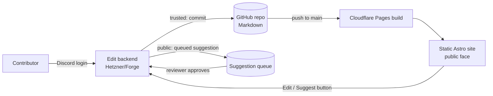

# OpenFront Wiki — Community Editing (Design)

**Date:** 2026-08-12
**Status:** Approved direction; phased delivery. This is the whole-system design; each phase gets its own spec + plan.

## Summary

Move the wiki from a hand-maintained static site to a **community-editable** one, while keeping the bespoke static site as the public face. Two contributor tiers: **trusted** members edit directly; **everyone else suggests** edits that a reviewer approves before they go live. Contributors sign in with **Discord only** — no GitHub account required. All content stays **git-backed Markdown**, so it is versioned, portable, and safe.

## Goals

- Anyone can propose changes; trusted members can make them directly.
- Suggested edits go through a review/moderation step before publishing.
- Keep the current bespoke Astro site, its design, sidebar, Pagefind search, and rich pages exactly as the public face.
- Content is durable and owned: versioned in git, plain Markdown, off-site backup via GitHub, one-click rollback.
- Low friction: Discord sign-in, no per-contributor GitHub accounts.

## Non-goals / Constraints

- The public site stays a **static Astro build on Cloudflare Pages**. It keeps serving even if the edit backend is down.
- The **OpenFront Masters** section stays an auto-generated Liquipedia mirror (CC BY-SA). It is rendered as today and is **not community-editable**.
- No secrets in the repo. The static site needs no secrets; the edit backend holds all credentials in server env.
- Reuse existing infra: GitHub repo (`openfrontio/wiki`), Cloudflare Pages auto-deploy on push to `main`, and the Hetzner VPS via Laravel Forge for the backend.

## Architecture (Approach A: Discord-auth edit service + git-backed Markdown)

Four components:

1. **Public static site** — the existing Astro build on Cloudflare Pages. Unchanged as the face; renders Markdown content and adds an "Edit / Suggest edit" affordance per page.
2. **Content store** — per-page **Markdown files in the repo** (e.g. `src/content/wiki/<slug>.md` with frontmatter), replacing `pages.json` for the editable (game/maps/guides) pages. Masters pages stay generated.
3. **Edit backend** — a small app on Hetzner (via Forge) that provides: Discord OAuth, role resolution, an editor API, a suggestion queue + moderation, and a **GitHub App ("bot")** with write access to the one repo. It performs all git operations server-side.
4. **GitHub repo** — source of truth and history. A push to `main` triggers Cloudflare to rebuild and publish. The backend commits via the bot; maintainers may still use GitHub directly.

## Contributor model & roles

- **Auth:** Discord OAuth. Identity = Discord user.
- **Trusted:** membership of a specific **role** in the OpenFront Discord guild (or a small allowlist). Trusted members edit directly and can review suggestions.
- **Public (any signed-in Discord user):** may submit suggested edits only.
- **Attribution:** the bot makes the commit; the contributor's Discord name is recorded in the commit author/message (e.g. `Edited by @DiscordName`). Real GitHub authorship is the bot; attribution is preserved in metadata.

## Editing & moderation flow

- **Edit button** on each page opens a Markdown editor (with live preview) prefilled with the page's current source.
- **Trusted submit** → backend validates + sanitises → bot commits to `main` → Cloudflare rebuilds → live in ~1 minute.
- **Public submit** → backend stores a **pending suggestion** (proposed Markdown + computed diff + Discord author). Nothing changes on the live site yet.
- **Moderation queue** (trusted-only, Discord-authed): reviewer sees the diff, then **approve** (bot commits) or **reject** (discard). Optional: edit-before-approve.
- **History & rollback:** every published change is a git commit; vandalism or a bad edit is reverted with a standard git revert (surfaced as a one-click action in the moderation UI later).

## Content model & migration

- **Convert editable pages** (game/maps/guides — not Masters) from `pages.json` HTML into Markdown files with frontmatter (`title`, `section`/category, `slug`, source flags). Astro renders them via **content collections**, preserving current styling.
- **Rich content mapping:** GitHub-Flavored Markdown covers tables and images; map figures and the few wiki-table/callout patterns get small, well-defined shortcodes/components so the rendered output matches today. Genuinely complex crawled HTML that does not map cleanly is either simplified during conversion or kept as scoped raw HTML on trusted-only pages.
- **Masters pages** remain produced by the existing Liquipedia pipeline and are rendered as today; they are excluded from the editor.
- **Sanitisation:** community Markdown is rendered through a sanitiser that forbids arbitrary/raw HTML and scripts; trusted edits may be granted more latitude. This protects the static build from injection.

## Security & abuse handling

- Bot token, Discord client secret, and session secrets live only in the backend's server env (Forge), never in the repo.
- Anti-spam on suggestions: rate limiting, a minimum Discord account age / guild-membership gate, optional captcha.
- Markdown sanitisation (above) prevents script/HTML injection reaching the published site.
- Vandalism recovery via git revert + the ability to lock a page to trusted-only.

## Phasing / decomposition

This is a multi-subsystem project. Build and ship in phases; each gets its own spec → plan → implementation.

1. **Phase 1 — Content → Markdown foundation.** Convert editable pages to Markdown; Astro renders them via content collections with identical output. No editing yet. Ship it: the public site looks the same, but content is now edit-ready files. *This is the foundation everything else depends on and is specced next.*
2. **Phase 2 — Edit UI (read/preview).** Add the "Edit / Suggest edit" affordance and the Markdown editor with live preview, wired to a stubbed backend.
3. **Phase 3 — Edit backend + trusted path.** Stand up the Hetzner/Forge app: Discord OAuth, role resolution, GitHub App bot, and the trusted "commit to `main`" path end to end.
4. **Phase 4 — Suggestions + moderation.** Pending-suggestion storage, the moderation queue, approve/reject → commit, and attribution.
5. **Phase 5 — Hardening & ops.** Anti-spam, page locking, revert action, runbook/docs, monitoring.

## Open questions (resolved in per-phase specs)

- Backend stack: Node vs Laravel/PHP (Forge is Laravel-friendly; Node is closer to the existing toolchain).
- Suggestion storage: backend DB queue vs bot-created branch/PRs.
- Exact Discord guild ID + the "trusted" role name.
- Editor library (Markdown editor with preview) and the shortcodes needed for figures/tables.
- Whether `pages.json` is fully replaced or kept as a generated artifact alongside the Markdown source.

## Risks

- **Lossy HTML→Markdown conversion** for complex pages — mitigated by shortcodes, scoped raw HTML on trusted pages, or leaving the hardest pages non-editable initially.
- **Two systems to keep healthy** (static face + backend) — mitigated by the static site being independent of backend uptime.
- **Moderation load** — mitigated by rate limits, trust gating, and keeping the reviewer UX fast.
